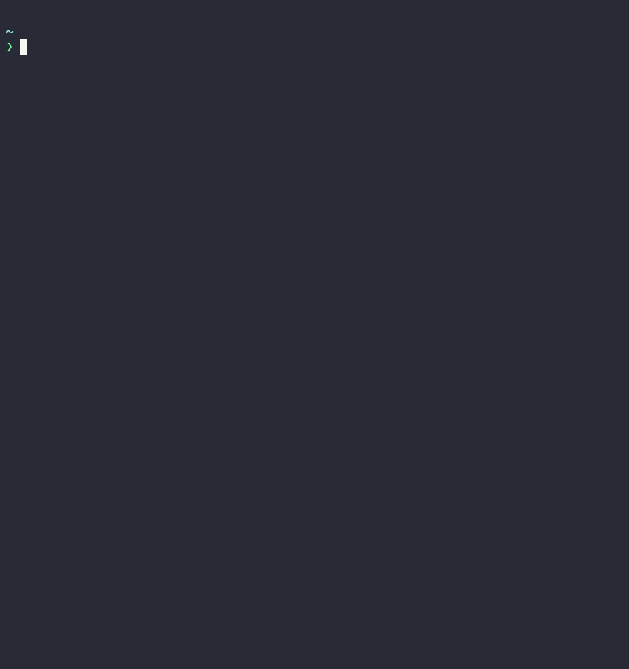

# Toolkit

This is an opinionated toolkit, which reflect my (@kjuulh) way of working. This
project aims to enhance a general workflow, and provides tools that may be
useful outside of project work. For project work see repo:kjuulh/bust or
repo:kjuulh/char, which aims for the same thing, but for projects themselves.

## Install

Currenly I only publish homebrew packages, however, all artifacts are released
via. released, that includes deb packages as well.

### Homebrew

```
brew install kjuulh/brew/toolkit
```

## Configuration

To use toolkit you will need a series of environment variables, they are only
needed if you need the associated tool.

```
export SRC_ENDPOINT=https://sourcegraph.com
export SRC_ACCESS_TOKEN=
export GITHUB_FC_ROOT="/Users/<username>/git/github.com"
export GITHUB_FC_ORGS="kjuulh"
```

`SRC` is sourcegraph integration. The endpoint is either to the public instance,
or your own domain. The access token is a personal access token. If either of
these are missing. A prompt will be shown on the first run

`GITHUB_FC` is the fuzzy clone setup. First is the destination path, this is
where the orgs will be placed. Second is ORGS, that is which orgs to subscribe
to. The total path in this case will end up being
`/Users/<username>/git/github.com/kjuulh`.

You will also require other integration such as a GitHub integration through
`gh`.

## Usage

```
Usage: toolkit <COMMAND>

Commands:
  prereqs
  tldr
  sourcegraph
  github
  stats
  init
  help         Print this message or the help of the given subcommand(s)

Options:
  -h, --help  Print help information
```


